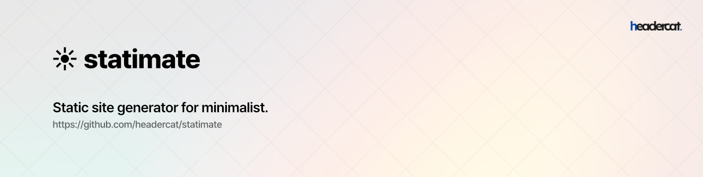

## Introduction

Statimate is a static site generator for minimalist. It aims to generate static sites with a modest level of tools 
without complex frontend libraries.
Statimate provides the following key features to make building static sites simple and fast.

* Intuitive routing directory structure.
* Multi-inheritable layout system.
* Easily extensible plugin system.
* Simple build/serve CLI tool which supports hot reloading.
* Built-in Laravel Blade template engine, Markdown parser, and more.
* Built-in plugins to boost productivity, including pagination helper, meta-tag manager, and more.

## Official Documentation

Documentation or statimate can be found at [the website](https://headercat.github.io/statimate).

## License

Statimate is open-sourced software licensed under the [MIT license](https://opensource.org/licenses/MIT).
